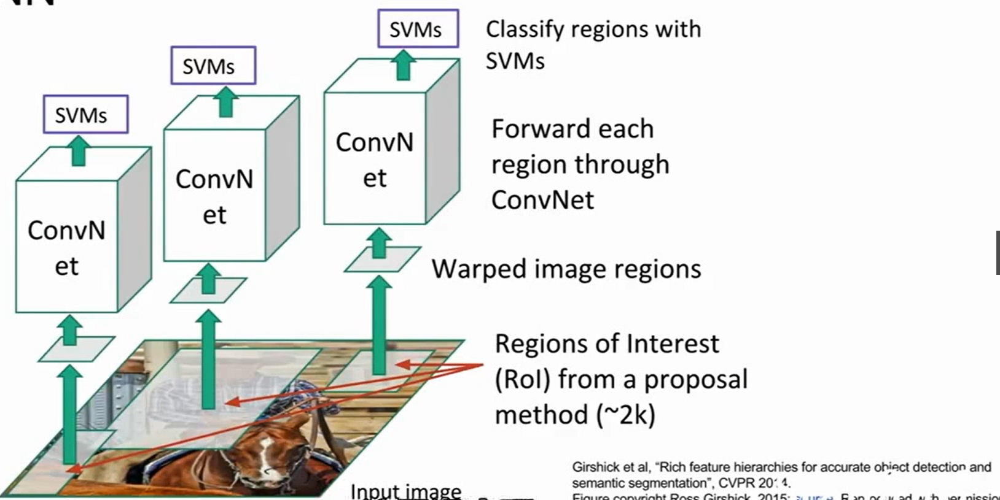
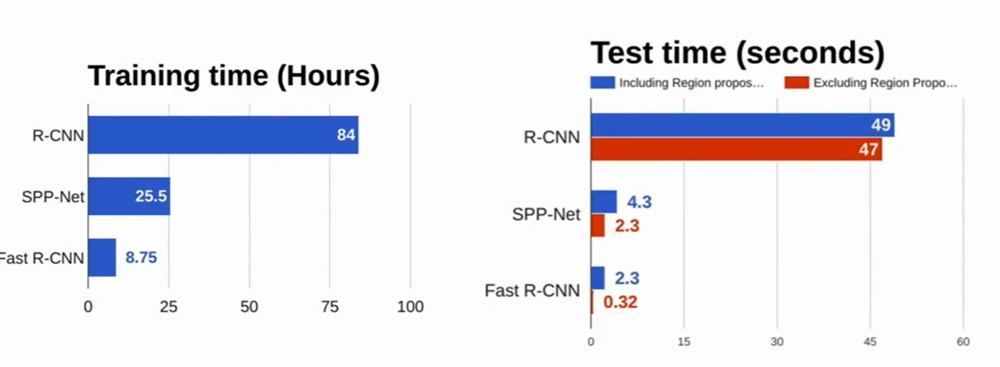
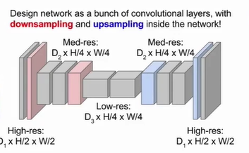

# Image Processing

## List
1. Double loss
2. R-CNN
3. Fast R-CNN
4. Faster R-CNN
5. YOLO and SSD

## Neural Network Design

### Double loss
To regconize the objects and locate it or draw the bounding-box,the neutral network produce two loss:one for regconization and another for location.The muti-task loss of the network is the combination of the two.

### R-CNN
Due to the complication of location of a object(thousands of tests),we can use ROI (Region of Interest)method,that chooses thousands of region,than do the classification.

problem:
- Slow
- memory-consume

Solution:Fast R-CNN

### Fast R-CNN

The Fast R-CNN costs most of time on computing the thousands of ROI.

Solution:Faster R-CNN

### Faster R-CNN
Make CNN do proposals!
Insert Reigon Proposal Network(__RPN__)to predict proposals from features.
Jointly train with 4 losses:
1. RPN classify object/not object
2. RPN regress box coordinates
3. Final classification score(object classes)
4. Final box coordiantes

### YOLO and SSD
Idea: Detection without Proposals.Instaed of trying to choose ROI,the algorithms below are design to see this problem like a regression problem.
1. YOLO:You only look once
2. SSD:Single shot detection

## Semantic Segmentation
__Semantic__ __Segmentation__ is to output a decision of a category for every pixel.
### Sliding Window

Extract patch from full image then classify the __center pixel__ with CNN.Sliding the window for whole image,we can classify all the pixels.

Problem: Very inefficient;Ignore the relationship of the shared features.

### Fully Convolution

Use fully convolution layer to give the scores for each pixel.

Problem:Super expensive.

#### Solution:Design the CNN with __Downsampling__ and __Upsampling__. 

Downsampling:Pooling,strided convolution

Upsampling:Unpooling;Transpose Convolution.

Unpooling:
- Nearst Neighbor
- Zeros Unpooling
- Bed of Nails
- Max Unpooling

Transpose Convolution or named deconvolution.
Recall 3 * 3 convolution,stride 2 and pad 1.

Traspose Convolution rather than take dot product,take the value of inputs to multiply the convolution core.
The overlapping area takes the sum of all the output.
## Localization

## Object Detection

