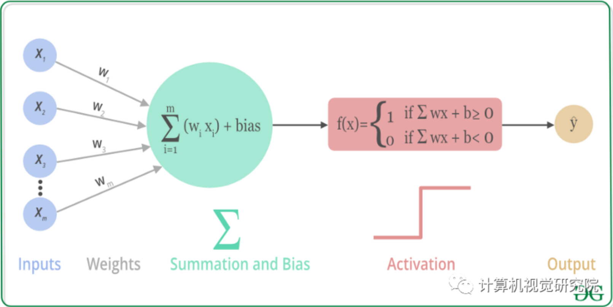
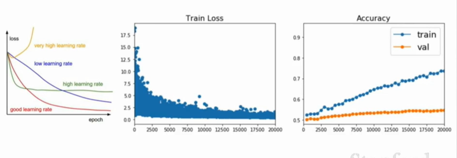

#  Trainning 
Volume 1

## Outline

1. Training Loop
2. Main point
3. Activation Functions
4. Weight Initialization
5. Batch Normalization(BN)
6. Babysetting the learning process and Hyperparameter Optimization

## Training Loop
1. Sample a batch of data
2. Forward to calculate the loss
3. Backprop to calculate the Gradients
4. Update the parameters by the Gradients

## Main point
1. One time setup
   1. Activation Functions
   2. Processing
   3. Weight Initialization
   4. Regularization
   5. Gradient Checking
2. Training Dynamics
   1. Babysitting the learning Process
   2. Parameter Updates
   3. Hyperparameter Optimization
3. Evaluation
   1. Model Ensembels
   
## Activation Functions

Summary:
In practice:
   - Use ReLU.Be careful with your learning rate
   - Try out Leaky ReLU/Maxout/ELU
   - Try out tanh but don't expect much
   - DONOT USE Sigmiod!
###  Sigmoid $$\sigma(x) = \frac{1}{1+\exp(-x)}$$
   - Squashes(压缩) numbers to range [0,1]
   - Historically popular since they have nice Interpretation a saturating "firing rate" of a neuron
   - $\frac{d\sigma(x)}{dx} = \sigma(x)(1-\sigma(x))$

3 problems:
1. Saturating neurons ''will'' kill the gradients.
        
        When the x is too large or too low,the gradient close to zero,which means ''killing the gradient''.

2. Sigmoid output are not zero-centered.
        
        If input is always positive the Gradient of W is always all positive or all negetive(this is also why you want zero-mean data) which slow the speed of updating(the change direction is limited).

3. exp() is a bit compute expensive

### tanh(x)
- squashed numbers to range[-1,1]
- zero centered(nice!)
- ''kill'' the gradients also
  
### ReLU 
$$f(x) = \max\{ Gate, x\}$$
good:
- Does not saturate (+region)
- very computationally efficient
- Converges(收敛) much faster then sigmiod
- Actually more biologically plausible than sigmiod

Bad:
- Not zero-centered
- Dead ReLU
        
        In some area it will never activate --> never update

### Leaky ReLU
$$f(x) = max\{\beta x,x\},\beta\in(0,1)$$
- Does not saturate (+region)
- Computationally efficient
- Converges much faster then sigmiod
- NOT DIE！！

#### Ex：Parametric Rectifier(PReLU):
$$PReLU(x) = max\{\alpha x,x\},\alpha\in(0,1)$$
where $\alpha$ is not a hyperparameter that specified by setting,but a parameter to learning,with more flexiblity.

### Exponential Linear Units(ELU)
$$ELU(x) = \begin{cases}
            x & {x \geq 0}\\
            \alpha(\exp(x)-1) & \text{x<0}
            \end{cases}$$
good:            
- All benefits of ReLU
- Closer to zero-mean output
- Negetive saturation regime compared with Leaky ReLU adds some robustness to noise

bad:
- Computation requires exp()(expensive)

### Maxout 
$$Maxout = \max\{\omega^T_1x+b_1,\omega^T_2x+b_2\}$$

good:
- Dose not have the basic form of dot product(nonlinearity)
- Generalizes ReLU and Leaky ReLU
- Linear Regime! Does not saturate!Does not Die!

bad:
- Double the number of parameters/neuron

## DATA Preprocessing
- Zero-Mean $ x^* = (x - mean)$
- Normalized $x^* = (x / std) $
- PCA (Principal Component Analysis)，即主成分分析方法，是一种使用最广泛的数据降维算法。
- Whitening

## Weight Initialization
- If $Weight_{init} = 0 $ then we will get a set of same neuron.
- First Idea:Small Random Numbers gaussian with zero mean and 1e-2 standard variation
    
        Work well for small networks,but problem with deeper networks.

        For the network goes deeper,the mean is about 0.000000,and the std will sharply go
        nearly to 0.000000

    By a deeper learning,ALL Activations collapse to zero!
- Secondly: If we choose tanh(x) as activate function and a large Weight , the output will be saturating and Gradiants are all zero.
- Xavier Initialization[Glort 2010]:Setting the std that maintains from input to output.
- But the ReLU kill half of the neurons,so a improved method is divide the std (using the Xavier method) by two.
- Futhermore Proper Initialization is an active area of research.

## Batch Normalization
To make each dimension unit guassian,apply:
$$ \hat{x^{(k)}} = \frac{x^{(k)} - E(x^{(k)})}{\sqrt{Var(x^{(k)})}}$$

Often Use after a FC layer.

Sometimes for more flexibility, we do scale(缩放) and shift(平移) on the normalized data.
$$ y^{(k)} = \gamma_k \hat{x^{(k)}} + \beta_k $$
where $\gamma$ and $\beta$ are learnable parameters.

One to be mentioned is that sometimes the network will learnig the $\gamma$ and $\beta$ to have it a identity mapping.

- Improve gradient flow through the network
- Allow higher learning rates
- Reduces the strong dependence on initialization
- Acts as a form of regularization in a funny way,and slightly reduces the need for dropout,maybe.

## Babysetting the learning process and Hyperparameter Optimization

It is about how do we monitor the training and how do we adjust the hyperperprameters as we go to get good learning results.
- Double check the loss is reasonable.
- Learning Rate is of most importance and most sensitive ,which need to nail first.Loss don't change:learning rate is too small;Loss is NaN：Too large learning rate.A good learning rate should make the loss change smoothly.
- Watch the gap between Train and Validation.A big gap == Overfitting, so you might increase the regularization strength;No gap means good,and you can increase the capacity of the model to some extent.

